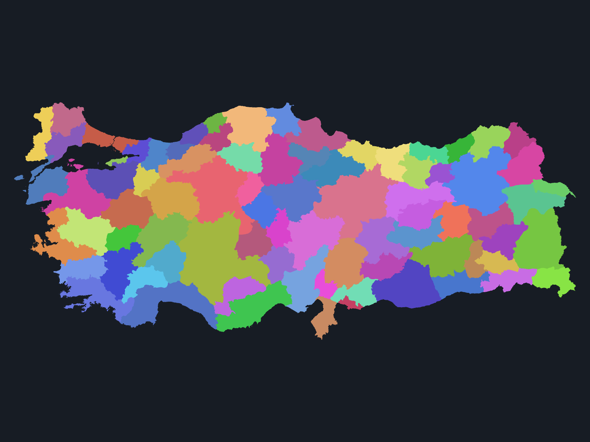

# TerritoryKit.Unity

Hiyerarşik, düzensiz poligon "bölgeler" (ülke → il → ilçe → mahalle) için Unity render adaptörü.
[TerritoryKit](https://github.com/mberatkaya/TerritoryKit) açık kaynak geospatial SDK'sının
web-dışı (MapLibre/Leaflet/OpenLayers dışı) ilk oyun motoru entegrasyonudur.

> Durum: Erken geliştirme (Faz 5 tamamlandı — Unity paketi render, pooling, viewport streaming ve
> seçimle çalışıyor, `v0.5.0`). Faz 6 sağlamlaştırma ve ilk yayınlanmış sürümü (`v0.6.0`)
> hedefliyor.



## Ne yapıyor, neden var

TerritoryKit poligon "bölgeler" için lookup, hiyerarşi, komşuluk ve viewport tabanlı yükleme
sağlıyor ama üç renderer adaptörü de (MapLibre, Leaflet, OpenLayers) web'e özel — hiçbir oyun
motoru entegrasyonu yok. Bu proje o boşluğu dolduruyor: bölge poligonlarını sunucu tarafında
üçgenler + LOD üretir, Unity tarafı bunları indirir, `Mesh`'e çevirir, havuzlar ve kamera
viewport'una göre akıtır.

**Neden ağır iş sunucuda?** Triangülasyon ve topoloji-güvenli basitleştirme CPU-yoğun. Mobil
cihazda her açılışta yapmak pil ve süre israfı; sunucuda bir kez hesaplanıp sonsuza kadar
cache'lenir (`Cache-Control: immutable` — bkz. [docs/api.md](docs/api.md)).

| Bileşen | Ne yapar |
|---|---|
| `services/geometry-api` (Python/FastAPI) | Bölge poligonlarını sunucu tarafında üçgenler, LOD üretir, binary mesh (TKMS) olarak servis eder |
| `packages/com.oguzhanonur.territorykit-unity` (C#/UPM) | Bu mesh'leri indirir, Unity `Mesh` nesnesine çevirir, havuzlar, viewport'a göre yükler/boşaltır, tıklamayı bölgeye eşler |

## Mimari

```
GeoJSON (geoBoundaries)
   │  territory import geoboundaries (vendor/territorykit CLI)
   ▼
dataset.json ──► territory geometry simplify (topology-safe, high/medium/low)
   │
   ▼
geometry-api build (earcut triangülasyon, WGS84→yerel metre projeksiyon)
   │
   ▼
TKMS mesh dosyaları × 3 LOD  ──►  FastAPI (/v1/datasets/.../mesh, .../viewport)
                                        │  UnityWebRequest, TKMB batch
                                        ▼
                          Unity: MeshDecoder → TerritoryPool → ViewportStreamer
                                        │
                                        ▼
                    Kamera viewport'una göre yüklenen/boşalan bölge Mesh'leri,
                    CPU nokta-üçgen picking, MaterialPropertyBlock renklendirme
```

Detaylar: [docs/mesh-format.md](docs/mesh-format.md) (TKMS binary format),
[docs/projection.md](docs/projection.md) (WGS84 → yerel metre), [docs/api.md](docs/api.md) (HTTP
sözleşmesi).

## Hızlı başlangıç — sıfırdan çalışan örnek

Bu akış Windows PowerShell içindir; clone adımından sonraki komutlar repo kökünden başlar.
Gereksinimler: Git, Python **3.12 veya yeni**, Node.js **22 veya yeni**, internet bağlantısı ve
örneği açmak için Unity **6000.1**. Python ve Node sürümlerini sırasıyla `python --version` ve
`node --version` ile kontrol edin.

```powershell
# 1) Repo ve sabitlenmiş TerritoryKit submodule'u
git clone https://github.com/yaziyorulasilamiyor/territorykit-unity.git
cd territorykit-unity
git submodule update --init --recursive

# 2) İzole Python ortamı ve API/build bağımlılıkları
python -m venv .venv
.\.venv\Scripts\python.exe -m pip install -e ".\services\geometry-api[dev]"

# 3) Submodule'deki TerritoryKit CLI
cd vendor\territorykit
corepack pnpm install --config.strict-dep-builds=false
corepack pnpm --filter "@territory-kit/cli..." build
cd ..\..

# 4) Gerçek TUR ADM1 verisi → üç LOD → doğrulanmış yayın
.\.venv\Scripts\python.exe scripts\fetch_sample_dataset.py
.\.venv\Scripts\python.exe scripts\build_lod.py --input "$PWD\services\geometry-api\data\datasets\turkey-provinces.geojson" --output "$PWD\services\geometry-api\data\build\tr-adm1" --clean
.\.venv\Scripts\python.exe scripts\publish_dataset.py --build-dir "$PWD\services\geometry-api\data\build\tr-adm1" --dataset-id tr-adm1 --artifacts-dir "$PWD\services\geometry-api\data\artifacts" --cache-dir "$PWD\services\geometry-api\data\cache"

# 5) API'yi artifacts/cache yollarının çözüldüğü dizinden başlat
cd services\geometry-api
..\..\.venv\Scripts\python.exe -m uvicorn geometry_api.main:app --host 127.0.0.1 --port 8000
```

Son komut terminali meşgul bırakır; repo kökünde ikinci bir PowerShell açıp sunucuyu doğrulayın:

```powershell
Invoke-RestMethod http://127.0.0.1:8000/health
Invoke-RestMethod http://127.0.0.1:8000/v1/datasets
```

İkinci yanıt 81 bölgeli `tr-adm1` dataset'ini göstermelidir; bu kimlik publish komutundaki
`--dataset-id` ile `BasicMap` örneğinin varsayılan `Dataset Id` alanının ortak değeridir.

Unity'de **Window → Package Management → Package Manager → + → Add package from git URL** ile
aşağıdaki URL'yi ekleyin, paket satırını seçip **Samples → Basic Map → Import** deyin, içe aktarılan
`BasicMap.unity` sahnesini açın ve **Play**'e basın:

```
https://github.com/yaziyorulasilamiyor/territorykit-unity.git?path=packages/com.oguzhanonur.territorykit-unity
```

Sahne `ViewportStreamer` ile kamera viewport'una göre yükleme, pooling ve tıkla-vurgulamayı
gösterir; ayrıntılı kullanım için [paket README'sine](packages/com.oguzhanonur.territorykit-unity/README.md)
bakın.

## Kurulum (Unity paketi)

**Gereksinim:** Unity **6000.1**'de geliştirildi ve test edildi. Kod 2023+ API kullanmıyor, bu
yüzden **2022.3 LTS** hedeflenen taban — ama bu ortamda 2022.3 kurulu değil, o yüzden elle
doğrulanmadı; bu bir niyet, doğrulanmış bir iddia değil.

Package Manager → **Add package from git URL**:

```
https://github.com/yaziyorulasilamiyor/territorykit-unity.git?path=packages/com.oguzhanonur.territorykit-unity
```

Build alırken `Shader.Find("Unlit/Color")` stripping'e takılabilir — bkz. paket README'sindeki
[Building a player](packages/com.oguzhanonur.territorykit-unity/README.md#building-a-player).

**Örnek sahnenin input backend'i:** `BasicMap` örneği *Project Settings → Player → Active Input
Handling* ayarının üçünde de (Old, New, Both) çalışır — koşullu derleme ile, pakete Input System
bağımlılığı eklemeden. Unity 6 yeni projelerde varsayılan olarak yalnız New seçili gelir; paketin
kendi geliştirme projesi Old'da kurulu olduğu için bu bir temiz-proje testinde ortaya çıktı (bkz.
`docs/phases/FAZ-6-RAPOR.md`).

## LOD üretimi (Faz 2)

Ham geoBoundaries GeoJSON'undan üç detay seviyesinde TKMS mesh üretmek — tek komut:

```bash
python scripts/build_lod.py --input services/geometry-api/data/datasets/turkey-provinces.geojson --output data/lod --clean
```

Zincir: normalizasyon → `territory import geoboundaries` (TerritoryKit CLI) → `dataset.json` →
seviye başına sadeleştirme + üçgenleme → `high/`, `medium/`, `low/` dizinleri ve `lod-report.json`.

### Önkoşul: TerritoryKit CLI

Zincirin import adımı submodule'deki CLI'ı kullanır, o yüzden bir kez build edilmeli:

```bash
cd vendor/territorykit
corepack pnpm install
corepack pnpm --filter "@territory-kit/cli..." build
```

| Gereksinim | Sürüm | Not |
|---|---|---|
| Node.js | `>=22` (denenen: 24.18.0) | `vendor/territorykit/package.json` `engines` alanı |
| pnpm | 11.7.0 | `packageManager` ile sabitlenmiş; `corepack pnpm` ayrıca kurulum istemez |

İki bilinen takoz:

- `corepack enable` Windows'ta `C:\Program Files\nodejs` altına yazamayıp `EPERM` verebilir.
  Gerek yok — `corepack pnpm ...` doğrudan çalışır.
- pnpm, `@scarf/scarf` (telemetri) paketinin install script'ini bloklayıp `ERR_PNPM_IGNORED_BUILDS`
  ile çıkış kodu 1 döner. Script'i **onaylamayın**; `pnpm config set strict-dep-builds false`
  ile uyarıyı hataya çevirmeyi kapatın. Paket yine çalıştırılmaz.

> Sadeleştirme neden TerritoryKit'in `--strategy topology-safe` komutuyla yapılmıyor:
> [docs/territorykit-simplification-finding.md](docs/territorykit-simplification-finding.md).

`--lod high|medium|low`; her seviye ayrı çıktı dizinine yazılır. 81 il ölçümü:

| Seviye | Vertex | high'ın %'si | Üçgen | Bayt | Parça | Delik |
|---|---|---|---|---|---|---|
| kaynak | 366.157 | — | — | — | 705 | 0 |
| high | 240.379 | %100 | 238.969 | 3.359.438 | 705 | 0 |
| medium | 85.926 | %35,7 | 84.518 | 1.197.108 | 704 | 0 |
| low | 30.753 | **%12,8** | 29.383 | 424.914 | 685 | 0 |

`high` her parçayı ve deliği koruyor (kayıp sıfır, build kapısı bunu zorluyor); `medium` ve `low`
küçük adaları bilerek düşürüyor ve düşen her parça `index.json`'a yazılıyor.

## Alternatifler

Dürüst karşılaştırma — hiçbiri "kötü", hepsi farklı bir ihtiyacı çözüyor:

- **[Cesium for Unity](https://github.com/CesiumGS/cesium-unity)** (Apache-2.0): v1.23'ten beri
  (Mart 2026) `CesiumGeoJsonDocumentRasterOverlay` ile stilize GeoJSON'u terrain/3D Tiles üzerine
  **raster katman** olarak drape edebiliyor. Bu ciddi bir yetenek — ama çıktı bir raster overlay;
  bölge başına ayrı bir `Mesh`, `MeshCollider`/CPU-picking ile üçgen-bazlı kesin bölge seçimi,
  havuzlanabilir GameObject vermiyor. Terrain/3D Tiles görselleştirmesi asıl amaçsa daha olgun.
- **[ArcGIS Maps SDK for Unity](https://developers.arcgis.com/unity/)**: kapsamlı bir platform
  ama bir Esri hesabı (ArcGIS Location Platform / ArcGIS Online) zorunlu, URP veya HDRP 12.x
  şart (Built-in render pipeline desteklenmiyor, mobilde HDRP compute shader'ları çoğu cihazda
  çalışmıyor), indirme boyutu yüzlerce MB'a varan native binary'ler içeriyor. Self-hosted, hesap
  gerektirmeyen bir kütüphane arayan için ağır.
- **[Mapbox Unity SDK](https://github.com/mapbox/mapbox-unity-sdk)**: vector tile → mesh
  dönüşümü yapıyor, bu paketle en yakın örtüşme. Ama bir Mapbox hesabına ve kullanım bazlı
  faturalandırmaya (MAU veya tile isteği başına) bağlı — self-hosted değil.
- **MapLibre**: resmi bir Unity SDK'sı yok.

**Sonuç:** bu paket, TerritoryKit'in kimlik/hiyerarşi/komşuluk modelinden **self-hosted, bölge
başına `Mesh`** üreten dar bir ihtiyaca hizmet ediyor — hesap gerektirmiyor, terrain/3D Tiles
görselleştirmesi ya da global harita kaplaması değil. Yukarıdakilerin yerini almaz.

## Geliştirme

Git akışı, dal stratejisi, commit kuralları ve Unity testlerini elle çalıştırma için
[CONTRIBUTING.md](CONTRIBUTING.md) dosyasına bakın.

## Örnek veri seti atfı

`scripts/fetch_sample_dataset.py` ile indirilen örnek Türkiye il sınırları
[geoBoundaries](https://www.geoboundaries.org/) gbOpen TUR ADM1 veri setinden gelir:

> © OpenStreetMap contributors, via geoBoundaries (wmgeolab) — lisans: CC BY-SA 2.0

Bu veri seti sadece yerel geliştirme/test içindir, repoya commit edilmez (bkz. `.gitignore`).

## Lisans

MIT — bkz. [LICENSE](LICENSE). Örnek veri seti ayrı bir lisans altındadır (yukarı bakın).
